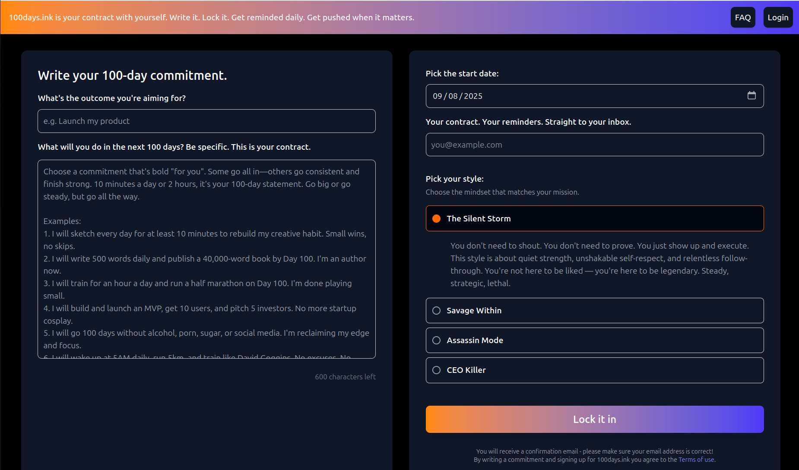

I’ve been building [100days.ink](https://100days.ink), a small app with a big purpose:  
help people commit to something for 100 days and actually follow through.

The rules are simple:

- Write down your 100-day commitment.  
- Pick a start or end date.  
- Decide if it’s private, public, or shared with the community.  
- Put some skin in the game — tip from $2 to $147.  

That’s it. No feeds. No distractions. Just you versus the next 100 days.

The idea comes from watching the video [I Worked Out Like David Goggins for 100 Days](https://youtu.be/vWU5O7cK7aI?si=Qvuerw0Zx3Y68PMf). Both showed me what happens when you commit: momentum compounds, discipline hardens, and you leave the dabbling behind. That lit the spark for my own 100-day project but instead of only fitness, I wanted to build a commitment engine. Something that turns promises into action and accountability into a game you can actually win.

Right now the code is still private, but I’ve been iterating in the open with a lean stack. Firebase gives me a NoSQL backend that provides good granual access control and easy auth. I extended it with Firebase Storage for images, because words aren’t always enough. On top of that I run a free cron-job.org task to push daily reminders with short coaching notes to the mailbox and a weekly digest newsletter. To make it dynamic, the AI coach actually changes tone: if you skip check-ins, the temperature parameter gets dialed up, making the responses a little sharper, a little more urgent. It was fun hacking psychology into the code.

And that’s really the point: 100days.ink isn’t just a website, it’s a tool for future-proofing your discipline. You declare a mission, you ink it, and you face yourself for 100 days straight. The app is minimal on purpose: less polish, more punch. A fun MVP.